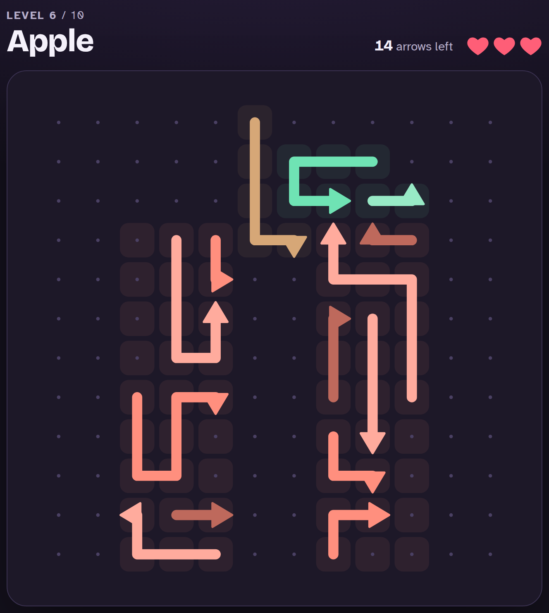
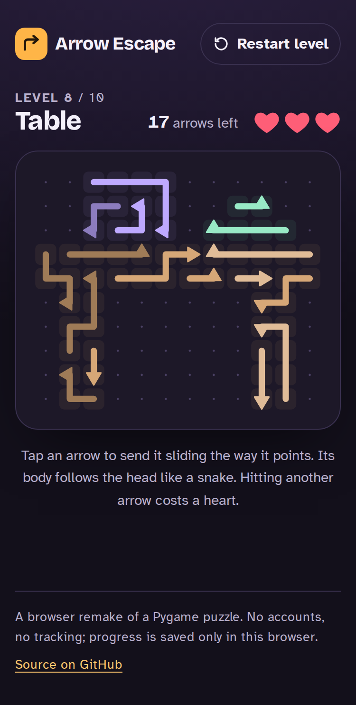

# Arrow Escape

### [▶ Play the live demo](https://fazal305.github.io/Arrow-Escape/)

A browser puzzle game about untangling arrows. Each arrow is a bent, snake-like
path on a grid. Tap one and it slides out the way its head points, with the
body following the head. If anything is in its way, you lose a heart. Clear
every arrow to finish the level. Lose all three hearts and you retry the level.

**Live demo:** [fazal305.github.io/Arrow-Escape](https://fazal305.github.io/Arrow-Escape/)





## Features

- **10 levels.** They start on small grids (First Steps, Crossroads,
  Switchbacks) and move on to picture boards: Diamond, Heart, Apple, Mug,
  Table, House and Tree.
- **Snake movement.** An arrow's body follows its head cell by cell, so a
  curled-up arrow can pass through a cell its own tail has already left.
- **3 hearts per level**, a shake and hit marker on collisions, plus Level
  Clear, Game Over and Campaign Complete overlays.
- **Every level is solvable.** The generator builds each level so it can be
  cleared, and the test suite checks every bundled level again.
- **Keyboard and screen-reader play.** Every arrow is a focusable button
  (Tab, then Enter or Space) with a descriptive label, and moves are
  announced in a live region.
- **Respects `prefers-reduced-motion`.** Arrows fade out instead of sliding,
  and the shake is replaced by a flash.
- **Progress is saved** to `localStorage` in your browser, so a reload keeps
  your level.

## Tech stack

- React 19 (function components and hooks) and Vite
- An SVG board (resolution independent, and every arrow is a DOM node, so
  keyboard focus works)
- Plain CSS with custom properties: no CSS framework
- Vitest for the engine and level tests, and oxlint for linting
- Self-hosted fonts via Fontsource: Bricolage Grotesque for display text,
  Atkinson Hyperlegible for body text

## Getting started

Requires Node 20 or newer.

```bash
git clone https://github.com/fazal305/Arrow-Escape.git
cd Arrow-Escape
npm install
npm run dev
```

| Script            | What it does                                             |
| ----------------- | -------------------------------------------------------- |
| `npm run dev`     | Start the dev server                                     |
| `npm run build`   | Production build into `dist/`                            |
| `npm run preview` | Serve the production build locally                       |
| `npm test`        | Engine, reducer and level-solvability tests              |
| `npm run lint`    | Lint with oxlint                                         |
| `npm run levels`  | Regenerate `src/levels/levels.json` from the shape masks |

**Environment variables:** none. The game is fully static, with no backend
and no API keys.

## How it works

```
src/
  game/engine.js        level parsing, collision and exit checks (pure functions)
  game/gameReducer.js   game state machine: playing → cleared / gameover / complete
  game/geometry.js      SVG helpers for arrow heads and colours
  game/progress.js      guarded localStorage read/write
  components/           Board, Arrow, LeavingArrow (slide animation), StatusBar, Modal
  levels/levels.json    level data
scripts/
  shapes.js             shape masks with colour regions
  generate-levels.js    fills masks with solvable arrow layouts
```

### Level format

Each level stores its grid as an array of strings, one character per cell:

| Char          | Meaning                                                      |
| ------------- | ------------------------------------------------------------ |
| `U` `D` `L` `R` | Arrow head; the letter is the direction it exits           |
| `^` `v` `<` `>` | Body segment; points at the next segment towards the head  |
| `.`           | Empty                                                        |

```json
{ "rows": [">v.", ".>R", "..."] }
```

That example is one arrow: tail at the top left, bending down and right, with
its head exiting to the right. `regions` (a matching mask) and `palette` set
each arrow's colour.

### Collision rule

When you tap an arrow, the engine walks from its head straight to the board
edge. The move is blocked if that line meets another arrow. It is also
blocked if it meets a segment of the arrow's own body that will still be in
that cell when the head arrives. Otherwise the arrow slides off and is
removed. Removing an arrow only ever frees space, which is why the solvability
check can simply keep removing any free arrow until the board is empty.

## Deployment

Pushing to `main` runs `.github/workflows/deploy.yml`, which tests, builds and
publishes `dist/` to GitHub Pages. In the repository settings, set
**Pages → Source** to **GitHub Actions**. The build uses relative asset paths,
so it also works on any static host (Netlify, Vercel, Cloudflare Pages) with no
changes.

## Privacy

There are no accounts, cookies, analytics or third-party requests: the fonts
are bundled. The only thing stored is your current level number, in your own
browser's `localStorage`.

## Contributing

See [CONTRIBUTING.md](CONTRIBUTING.md) and the
[Code of Conduct](CODE_OF_CONDUCT.md). Report security issues as described in
[SECURITY.md](SECURITY.md).

## License

Free for personal, educational, and noncommercial use under the [PolyForm Noncommercial License 1.0.0](LICENSE).

Commercial use requires a paid commercial license. Contact fazalabbas2002@gmail.com.

Versions up to and including `v1.0.0-mit` were released under the MIT License and remain available under MIT.
